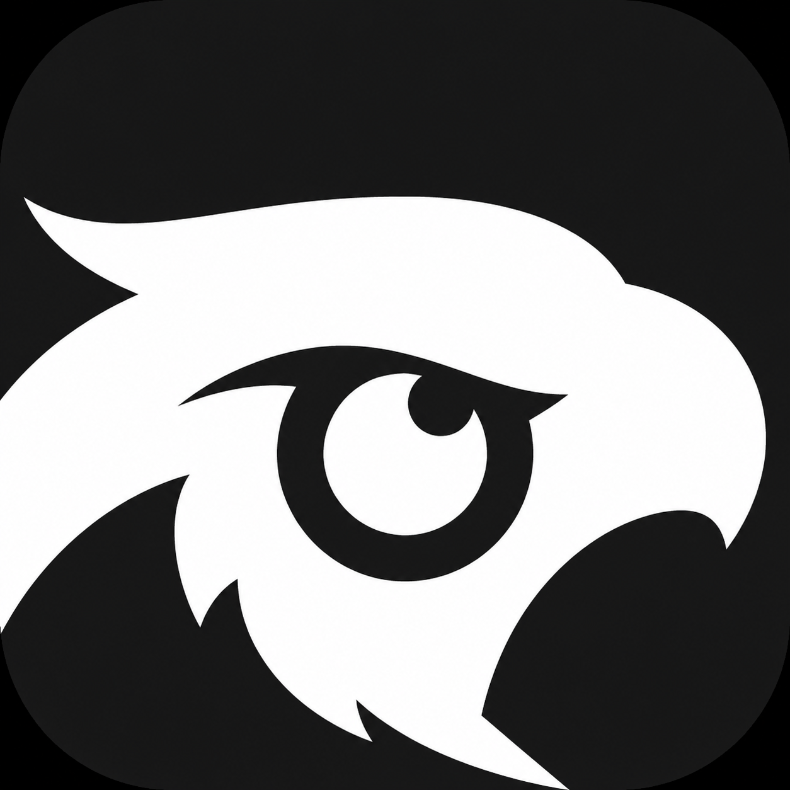
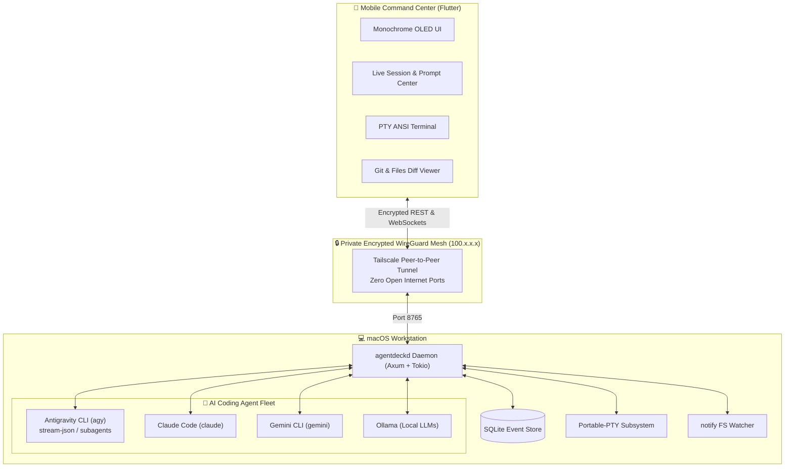

<p align="center">
  
</p>

<h1 align="center">AgentDeck</h1>

<p align="center">
  <b>Local-First Remote AI Engineering Control Plane</b><br>
  <i>Monitor, prompt, and control AI coding agents running on your Mac from your phone via private Tailscale mesh.</i>
</p>

<p align="center">
  <a href="https://github.com/darknecrocities/Agentdeck/blob/main/LICENSE"></a>
  <a href="https://www.rust-lang.org/"></a>
  <a href="https://flutter.dev/"></a>
  <a href="https://tailscale.com/"></a>
  <a href="https://github.com/darknecrocities/Agentdeck"></a>
</p>

---

## 🎯 What is AgentDeck?

The goal of AgentDeck is **NOT** to build another AI coding agent.  
The goal is to build an **autonomous remote control plane** around the coding agents you already use.

Leave your MacBook running AI coding agents at home, walk outside with your phone, and seamlessly:
- 📱 **Monitor live progress & thinking**: Watch file edits, subagent delegations, and plan progress in real time.
- ⚡ **Send follow-up prompts**: Guide agents or dispatch new instructions via phone.
- 🛑 **Approve or deny high-risk actions**: Review dangerous shell commands or destructive operations before execution.
- 💻 **Interactive PTY Terminal**: Access full remote zsh shells with mobile modifier keys.
- 🔍 **Live Git & Diff inspection**: Review syntax-highlighted unified diffs, commits, and GitHub PRs.
- 🔒 **Zero Public Ports**: Direct peer-to-peer encrypted WireGuard tunnel using Tailscale.

---

## 🏗️ System Architecture



---

## 🌟 Key Features

### 1. First-Class Google Antigravity CLI (`agy`) Integration
- Direct execution via `--output-format stream-json`.
- Event streaming for `ThinkingStarted`, `ThinkingUpdate`, `ToolStarted`, `ToolFinished`, `FileCreated`, `FileModified`, `CommandStarted`, `CommandFinished`, and `SubagentStarted`.
- Native session continuation with `agy --continue` or `agy --conversation <id>`.

### 2. Multi-Agent Ecosystem
- Unified `AgentAdapter` async trait supporting **Antigravity CLI**, **Claude Code**, **Gemini CLI**, and **Ollama Local**.
- Automated binary detection, capability matrices, and status diagnostics.

### 3. Persistent 24/7 Local Daemon (`agentdeckd`)
- Jobs continue executing when the phone disconnects or goes to sleep.
- Monotonic `event_id` sequential database replay allows the app to catch up instantly upon reconnection.

### 4. Interactive PTY Terminal Subsystem
- Real `/bin/zsh` pseudo-terminal instances powered by `portable-pty`.
- Mobile touch modifier key bar: `Ctrl+C`, `Tab`, `Esc`, `↑`, `↓`, `Enter`, `Clear`.

### 5. Security & Human-in-the-Loop Approvals
- Path traversal protection (rejection of unauthorized workspace paths).
- Risk classifier intercepts dangerous operations (`rm -rf`, `git push --force`, `drop database`) and holds them in an approval queue until confirmed on mobile.

### 6. Minimalist Black & White Monochrome Aesthetics
- High-contrast OLED pure black (`#000000`) and razor white (`#FFFFFF`) palette.
- Monospace typography via JetBrains Mono and ASCII progress bars (`████████░░░░ 75%`).

---

## 🚀 Quick Start Guide

### Prerequisites
- macOS Workstation (Apple Silicon or Intel)
- Rust 1.80+ (`curl --proto '=https' --tlsv1.2 -sSf https://sh.rustup.rs | sh` or `brew install rust`)
- Flutter 3.24+ (optional for building mobile client)
- [Tailscale](https://tailscale.com) (free account for remote access)

---

### Step 1: Clone & Configure

```bash
git clone https://github.com/darknecrocities/Agentdeck.git
cd Agentdeck

# Copy environment template
cp .env.example .env
```

Edit `.env` to configure your settings and optional API keys:
```bash
AGENTDECK_HOST=0.0.0.0
AGENTDECK_PORT=8765
AGENTDECK_REQUIRE_AUTH=false
AGENTDECK_AUTH_TOKEN=your-custom-secure-token
```

---

### Step 2: Automated 24/7 Installation

Run the one-click setup script to build release binaries, install the `launchd` background service, and verify system agents:

```bash
./scripts/setup-all.sh
```

This installs `agentdeckd` as a persistent background daemon that starts automatically on Mac boot and auto-restarts if stopped.

---

### Step 3: Run System Diagnostics

Verify all agents and subsystems:

```bash
./target/release/agentdeck doctor
```

Output:
```
═══════════════════════════════════════════════════
           AGENTDECK SYSTEM DOCTOR REPORT          
═══════════════════════════════════════════════════
Checking AgentDeck Daemon (http://127.0.0.1:8765) ... [OK]
Checking Antigravity CLI (`agy`) ... [FOUND]
Checking Claude Code CLI (`claude`) ... [FOUND]
Checking Gemini CLI (`gemini`) ... [FOUND]
Checking Ollama (`ollama`) ... [FOUND]
Checking Git (`git`) ... [FOUND]
Checking GitHub CLI (`gh`) ... [FOUND]
Checking Tailscale ... [FOUND] (100.114.182.27)
Checking Local Storage & Permissions ... [OK]
═══════════════════════════════════════════════════
System is READY for AgentDeck mobile connections!
```

---

### Step 4: Launch Mobile Command Center

#### Option A: Install Pre-Built Android APK
Transfer `~/Desktop/AgentDeck.apk` or `agentdeck_mobile/build/app/outputs/flutter-apk/app-release.apk` to your phone and install.

#### Option B: Run via Flutter
```bash
cd agentdeck_mobile
flutter run
```

---

### Step 5: Connect Mobile App via Tailscale

1. Ensure **Tailscale** is connected on both your Mac and your Phone under the same account.
2. In the **AgentDeck Mobile App**, navigate to **Settings**.
3. Set the **Daemon Endpoint** to your Mac's Tailscale IP:
   ```
   http://100.114.182.27:8765
   ```
4. Tap **"Test Ping"** and **"Save Config"**.

---

## 📡 API Reference

| Endpoint | Method | Description |
| :--- | :--- | :--- |
| `/health` | `GET` | Daemon health & version check |
| `/api/device` | `GET` | CPU, RAM, Disk, and Host telemetry |
| `/api/status` | `GET` | Active sessions, approvals, and Tailscale info |
| `/api/diagnostics` | `GET` | Comprehensive system & agent doctor diagnostics |
| `/api/projects` | `GET`, `POST` | List and register workspace directories |
| `/api/projects/:id/files` | `GET` | File browser and contents inspection |
| `/api/projects/:id/git/status` | `GET` | Repository branch and modified files |
| `/api/projects/:id/git/diff` | `GET` | Unified working tree diff |
| `/api/projects/:id/git/commit` | `POST` | Stage and commit workspace changes |
| `/api/projects/:id/git/push` | `POST` | Push current branch to remote |
| `/api/agents` | `GET` | Installed agent adapters & capabilities |
| `/api/sessions` | `GET`, `POST` | List and launch new agent sessions |
| `/api/sessions/:id` | `GET` | Inspect active session state |
| `/api/sessions/:id/prompt` | `POST` | Dispatch follow-up instruction to agent |
| `/api/sessions/:id/continue` | `POST` | Resume conversation with `--continue` |
| `/api/sessions/:id/stop` | `POST` | Stop active agent process |
| `/api/approvals` | `GET` | List pending high-risk approval requests |
| `/api/approvals/:id/approve` | `POST` | Approve pending command execution |
| `/api/approvals/:id/deny` | `POST` | Deny and cancel pending command |
| `/api/terminal/session` | `POST` | Spawn interactive PTY shell |
| `/ws/events` | `WS` | Real-time global event stream with replay |
| `/ws/sessions/:id` | `WS` | Real-time session event stream |
| `/ws/terminal/:id` | `WS` | Bidirectional PTY terminal stream |

---

## 📱 Mobile App Screens

<table align="center">
  <tr>
    <td align="center"><b>Dashboard</b><br>Hardware telemetry & Antigravity dispatcher</td>
    <td align="center"><b>Session Controller</b><br>Live plan checklist & prompt input</td>
    <td align="center"><b>Interactive Terminal</b><br>ANSI PTY shell with quick keys</td>
  </tr>
  <tr>
    <td align="center"><b>Files & Git Diff</b><br>File tree and unified syntax diffs</td>
    <td align="center"><b>Approvals Queue</b><br>High-risk security action gates</td>
    <td align="center"><b>Activity Timeline</b><br>Chronological event logs with replay</td>
  </tr>
</table>

---

## 🔒 Security Architecture

- **Local-First**: All data, code, and session logs reside strictly on your local computer (`agentdeck.db`).
- **Encrypted Transport**: Communications between phone and Mac route exclusively through Tailscale WireGuard tunnels.
- **Path Traversal Guard**: Prevents agents from accessing directories outside registered project boundaries.
- **Human-in-the-Loop Gate**: Commands flagged with dangerous keywords (`rm -rf`, `format`, `drop`, `force`) require explicit mobile authorization.

---

## 📄 License

This project is licensed under the MIT License - see the [LICENSE](LICENSE) file for details.
