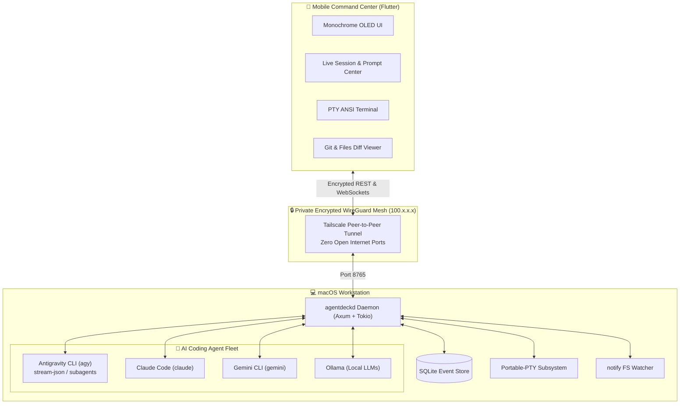

<p align="center">
  
</p>

<h1 align="center">AgentDeck</h1>

<p align="center">
  <b>Local-First Remote AI Engineering Control Plane</b><br>
  <i>Monitor, prompt, and control AI coding agents running on your Mac from your phone via private Tailscale mesh.</i>
</p>

<p align="center">
  <a href="https://github.com/darknecrocities/Agentdeck/blob/main/LICENSE"></a>
  <a href="https://www.rust-lang.org/"></a>
  <a href="https://flutter.dev/"></a>
  <a href="https://tailscale.com/"></a>
  <a href="https://github.com/darknecrocities/Agentdeck"></a>
</p>

---

## 🎯 What is AgentDeck?

The goal of AgentDeck is **NOT** to build another AI coding agent.  
The goal is to build an **autonomous remote control plane** around the coding agents you already use.

Leave your MacBook running AI coding agents at home, walk outside with your phone, and seamlessly:
- 📱 **Monitor live progress & thinking**: Watch file edits, subagent delegations, and plan progress in real time.
- ⚡ **Send follow-up prompts**: Guide agents or dispatch new instructions via phone.
- 🛑 **Approve or deny high-risk actions**: Review dangerous shell commands or destructive operations before execution.
- 💻 **Interactive PTY Terminal**: Access full remote zsh shells with mobile modifier keys.
- 🔍 **Live Git & Diff inspection**: Review syntax-highlighted unified diffs, commits, and GitHub PRs.
- 🔒 **Zero Public Ports**: Direct peer-to-peer encrypted WireGuard tunnel using Tailscale.

---

## 🏗️ System Architecture



---

## 🌟 Key Features

### 1. 🤖 First-Class Multi-Agent AI Engine Integration
- **Google Antigravity (`agy`) Core Integration**:
  - Native JSON stream execution (`--output-format stream-json`).
  - Interception of Chain of Thought (CoT) reasoning (`THINKING` steps, planning milestones, subagent delegation).
  - Real-time live transcript parser reading `~/.gemini/antigravity-ide/brain/<id>/.system_generated/logs/transcript.jsonl`.
  - Session continuation via `agy --continue` or `agy --conversation <id>`.
  - Interactive prompt dispatching and structured decision interception.
- **Multi-Agent Ecosystem Support**:
  - Unified `AgentAdapter` async trait supporting **Google Antigravity (`agy`)**, **Anthropic Claude Code (`claude`)**, **Google Gemini CLI (`gemini`)**, and **Ollama Local Fleet (`ollama`)**.
  - Claude Code `<thinking>` XML token parsing and print streaming.
  - Gemini CLI long-context execution with structured function calling.
  - Ollama local fleet support for offline models (`deepseek-r1`, `qwen2.5-coder:32b`, `codellama:70b`, `llama3.3:70b`) with native R1 `<think>` token stream parsing.
- **Automated System Doctor & Capability Matrix**:
  - CLI diagnostic tool (`agentdeck doctor`) for binary detection, PATH verification, and daemon connectivity.

### 2. 🔑 Remote Account Switcher & Auth Management
- **1-Tap Google OAuth Account Switcher**:
  - Remote management of active Google profiles in `~/.gemini/google_accounts.json` and `~/.gemini/oauth_creds.json`.
  - Switch active Google coding accounts instantly from mobile without touching host terminal.
  - Profile linking, account removal, and credential auth status verification.

### 3. 📊 Token Quota & Usage Rate Limit Monitor
- **Gemini & Claude Token Usage Tracking**:
  - Live RPM / TPM rate limit visualization and quota meters.
  - Real-time token consumption history per active session.
  - Synchronized IDE quota monitoring directly from mobile client.

### 4. 💻 Workstation Telemetry & Remote Hardware Control
- **Multi-Workstation Fleet Switcher**:
  - Seamlessly switch control between multiple workstation nodes (macOS, Windows, Linux) from one mobile app.
- **Live Desktop Screen Streaming & Remote Snapshot**:
  - Low-latency continuous workstation screen streaming (`/ws/screen`) with double-tap pinch zoom and live frame capture.
- **Live Webcam Monitoring & Hardware Privacy Control**:
  - Workstation webcam live feed and snapshot view.
  - Hardware privacy toggle (`/api/system/camera/stop`) to immediately release camera device & turn off hardware LED.
- **Voice Walkie-Talkie & OS Speech Synthesis**:
  - Speak into mobile phone to broadcast voice directly through workstation speakers via native OS TTS (`say` on macOS, PowerShell SAPI on Windows, `espeak` on Linux).
  - Dispatch voice prompts directly into active AI coding agent sessions.
- **Workstation Locating Audio Alarm**:
  - 1-tap remote audio alert chime to locate physical host machine in home/office (`/api/system/play-sound`).
- **1-Tap Remote App Launcher**:
  - Instantly launch desktop applications (VS Code, Terminal, Antigravity IDE, Google Chrome, Cursor) from mobile.
- **Remote File Browser & Mobile File Uploader**:
  - Full file tree browser, directory creation (`/api/system/mkdir`), and file content reader.
  - Upload code assets, images, and files up to 500MB directly into project workspace folders.
- **Hardware Telemetry Dashboard**:
  - Real-time host CPU usage percentage, RAM utilization, and available Disk GB space.

### 5. ⚡ Interactive Portable PTY Terminal Subsystem
- **Full Pseudo-Terminal (`portable-pty`)**:
  - Persistent `/bin/zsh` or PowerShell PTY instances streaming over WebSocket (`/ws/terminal/:id`).
  - Windows `\r\n` line ending normalization for cross-platform terminal compatibility.
- **Mobile Touch Modifier Quick-Bar**:
  - Touch toolbar with `Ctrl+C`, `Tab`, `Esc`, `↑`, `↓`, `Enter`, `Clear`, and modifier keys.
- **ANSI Color Rendering**:
  - High-performance ANSI color code rendering and full output scrollback.

### 6. 🔍 Git & GitHub Repository Management
- **Working Tree & Branch Tracking**:
  - Real-time branch monitoring, modified files list, and git commit history (`/api/projects/:id/git/log`).
- **Syntax-Highlighted Unified Diff Viewer**:
  - File-by-file syntax diff inspection (`+` added, `-` removed lines) with line numbers and file breadcrumbs.
- **1-Tap Mobile Commit, Push & Pull**:
  - Stage, commit with message synthesis, and push/pull remote branches directly from mobile.
- **GitHub Integration**:
  - Pull Request status, creation, and issue linking (`/api/projects/:id/github`).

### 7. 🔒 Security, Sandboxing & Human-in-the-Loop Approvals
- **Path Traversal Guard**:
  - Strict canonical path verification blocking agents from accessing directories outside configured project roots.
- **Automated Risk Classifier**:
  - Intercepts high-risk destructive operations (`rm -rf`, `git push --force`, DB reset, credential file edits).
- **Mobile Push Approvals Queue**:
  - Suspends agent execution and pushes approval alert to mobile client with diff preview and 1-tap `Approve` / `Deny` gates.
- **Zero Open Public Ports**:
  - Local-first peer-to-peer WireGuard mesh encryption via Tailscale (`100.x.y.z`).

### 8. ⚡ 24/7 Persistent Daemon (`agentdeckd`) & Event Replay
- **Background Service Installation**:
  - Auto-starting daemon via macOS `launchd` plist or Windows Scheduled Task (`AgentDeckDaemon`).
- **SQLite Persistent Event Store**:
  - Transactional event and log storage (`agentdeck.db`) surviving network dropouts or phone reboots.
- **Monotonic `event_id` Replay**:
  - Mobile client automatically catches up on missed events sequentially upon reconnection.

### 9. 🎨 Obsidian Titanium Monochrome Design System
- **Pure Black OLED Aesthetic**:
  - High-contrast `#000000` dark mode with white accents (`#FFFFFF`).
- **Monospace & Typography**:
  - JetBrains Mono font, custom ASCII progress meters (`████████░░░░ 75%`), micro-animations, and status radars.

---

## 🚀 Quick Start Guide

### Prerequisites
- **macOS** or **Windows** Workstation
- Rust 1.80+ (`curl --proto '=https' --tlsv1.2 -sSf https://sh.rustup.rs | sh` on macOS/Linux, or [rustup.rs](https://rustup.rs) on Windows)
- Flutter 3.24+ (optional for building mobile client)
- [Tailscale](https://tailscale.com) (free mesh VPN for secure remote phone access)

---

### Step 1: Clone Repository

```bash
git clone https://github.com/darknecrocities/Agentdeck.git
cd Agentdeck
```

---

### Step 2: Automated 24/7 Background Service Installation

#### 🍏 On macOS:
Run the one-click setup script to build release binaries, install the `launchd` background service (auto-starts on boot), and verify system agents:
```bash
./scripts/setup-all.sh
```

#### 🪟 On Windows:
Run the automated PowerShell installer or double-click `scripts\setup-windows.bat`:
```powershell
powershell -ExecutionPolicy Bypass -File .\scripts\install-windows-service.ps1
```
This automatically:
- Builds release binaries (`agentdeckd.exe` and `agentdeck.exe`).
- Adds `~/.agentdeck/bin` to your User PATH.
- Configures `.env` and detects your Windows Tailscale IP (`100.x.x.x`).
- Registers a Windows Scheduled Task (`AgentDeckDaemon`) that auto-starts `agentdeckd` on login silently in the background without needing manual `cargo run`.
- Configures Windows Firewall for port 8765.

---

### Step 3: Run System Diagnostics

Verify all agents and subsystems:

```bash
# macOS / Linux
./target/release/agentdeck doctor

# Windows
.\target\release\agentdeck.exe doctor
```

Output:
```
═══════════════════════════════════════════════════
           AGENTDECK SYSTEM DOCTOR REPORT          
═══════════════════════════════════════════════════
Checking AgentDeck Daemon (http://127.0.0.1:8765) ... [OK]
Checking Antigravity CLI (`agy`) ... [FOUND]
Checking Claude Code CLI (`claude`) ... [FOUND]
Checking Gemini CLI (`gemini`) ... [FOUND]
Checking Ollama (`ollama`) ... [FOUND]
Checking Git (`git`) ... [FOUND]
Checking GitHub CLI (`gh`) ... [FOUND]
Checking Tailscale ... [FOUND] (100.x.x.x)
Checking Local Storage & Permissions ... [OK]
═══════════════════════════════════════════════════
System is READY for AgentDeck mobile connections!
```

---

### Step 4: Connect Mobile App via Tailscale WireGuard Mesh

1. Ensure **Tailscale** is running on both your machine and your phone under the same Tailscale network.
2. In the **AgentDeck Mobile App**, navigate to **Settings** or tap the **Tailscale Mesh** banner.
3. Set the **Daemon Endpoint** to your machine's Tailscale IP:
   ```
   http://100.x.x.x:8765
   ```
4. Tap **"Test Ping"** and **"Save Config"**.

> 📖 **For full multi-node fleet setup, MagicDNS, and platform guides, see [SETUP.md](SETUP.md).**

---

## 📡 API Reference

| Endpoint | Method | Description |
| :--- | :--- | :--- |
| `/health` | `GET` | Daemon health & version check |
| `/api/device` | `GET` | CPU, RAM, Disk, and Host telemetry |
| `/api/status` | `GET` | Active sessions, approvals, and Tailscale info |
| `/api/diagnostics` | `GET` | Comprehensive system & agent doctor diagnostics |
| `/api/system/browse` | `GET` | Browse host machine directories |
| `/api/system/mkdir` | `POST` | Create new directory on host machine |
| `/api/system/ping_workstation` | `GET` | Ping workstation latency & health check |
| `/api/system/launch-app` | `POST` | Launch remote desktop applications (VS Code, Terminal, etc.) |
| `/api/system/speak` | `POST` | Broadcast mobile voice to workstation speakers via OS TTS |
| `/api/system/play-sound` | `POST` | Play workstation locating audio alert |
| `/api/system/screenshot` | `GET` | Capture high-speed workstation desktop frame |
| `/api/system/camera` | `GET` | Capture workstation webcam frame / snapshot |
| `/api/system/camera/stop` | `POST` | Stop webcam stream & release camera hardware LED |
| `/api/files/upload` | `POST` | Upload media, code, and files into workspace directories |
| `/api/projects` | `GET`, `POST` | List and register workspace directories |
| `/api/projects/scaffold` | `POST` | Bootstrap/scaffold new project templates |
| `/api/projects/:id` | `DELETE` | Unregister project directory |
| `/api/projects/:id/files` | `GET` | Workspace file tree navigation |
| `/api/projects/:id/files/content` | `GET` | View file contents with line range support |
| `/api/projects/:id/git/status` | `GET` | Repository branch and modified files |
| `/api/projects/:id/git/diff` | `GET` | Unified working tree diff |
| `/api/projects/:id/git/log` | `GET` | Git commit history log |
| `/api/projects/:id/git/commit` | `POST` | Stage and commit workspace changes |
| `/api/projects/:id/git/push` | `POST` | Push current branch to remote |
| `/api/projects/:id/git/pull` | `POST` | Pull remote changes into working branch |
| `/api/projects/:id/github` | `GET` | GitHub repository metadata & PR status |
| `/api/agents` | `GET` | Installed agent adapters & capabilities |
| `/api/accounts/antigravity` | `GET` | Current Antigravity Google account profile |
| `/api/accounts/antigravity/switch` | `POST` | 1-tap switch active Google account profile |
| `/api/tokens/summary` | `GET` | Gemini & Claude token quota usage summary |
| `/api/tokens/sync-ide` | `POST` | Sync token quotas with active IDE instance |
| `/api/sessions` | `GET`, `POST` | List and launch new agent sessions |
| `/api/sessions/:id` | `GET` | Inspect active session state |
| `/api/sessions/:id/prompt` | `POST` | Dispatch follow-up prompt to running agent |
| `/api/sessions/:id/continue` | `POST` | Resume conversation with `--continue` |
| `/api/sessions/:id/stop` | `POST` | Stop active agent process |
| `/api/approvals` | `GET` | List pending high-risk approval requests |
| `/api/approvals/:id/approve` | `POST` | Approve pending command execution |
| `/api/approvals/:id/deny` | `POST` | Deny and cancel pending command |
| `/api/terminal/session` | `POST` | Spawn interactive PTY shell |
| `/ws/events` | `WS` | Real-time global event stream with replay |
| `/ws/sessions/:id` | `WS` | Real-time session event stream |
| `/ws/terminal/:id` | `WS` | Bidirectional PTY terminal stream |
| `/ws/screen` | `WS` | Live workstation desktop screen video stream |

---

## 📱 Mobile App Screens

<table align="center">
  <tr>
    <td align="center"><b>Dashboard</b><br>Hardware telemetry & Antigravity dispatcher</td>
    <td align="center"><b>Session Controller</b><br>Live plan checklist & prompt input</td>
    <td align="center"><b>Interactive Terminal</b><br>ANSI PTY shell with quick keys</td>
  </tr>
  <tr>
    <td align="center"><b>Files & Git Diff</b><br>File tree and unified syntax diffs</td>
    <td align="center"><b>Approvals Queue</b><br>High-risk security action gates</td>
    <td align="center"><b>Activity Timeline</b><br>Chronological event logs with replay</td>
  </tr>
</table>

---

## 🔒 Security Architecture

- **Local-First**: All data, code, and session logs reside strictly on your local computer (`agentdeck.db`).
- **Encrypted Transport**: Communications between phone and Mac route exclusively through Tailscale WireGuard tunnels.
- **Path Traversal Guard**: Prevents agents from accessing directories outside registered project boundaries.
- **Human-in-the-Loop Gate**: Commands flagged with dangerous keywords (`rm -rf`, `format`, `drop`, `force`) require explicit mobile authorization.

---

## 📄 License

This project is licensed under the MIT License - see the [LICENSE](LICENSE) file for details.
